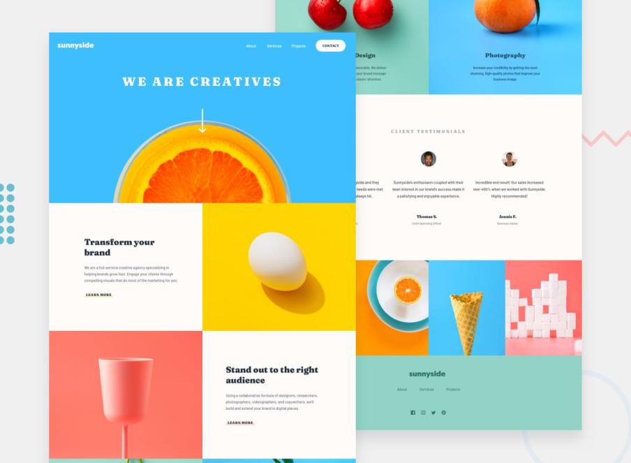

# Sunnyside Agency
_Here our project of Sunnyside Agency!_

</br>

A collaboration between **Semih** and **Antoine** !!

**[This is our web page](https://semihbk.github.io/sunnyside-agency/)**

</br>
</br>
</br>

 ### Our work is based on this mockup:
 
 <br>
 <br>



</br>
</br>
</br>

```
The Room Of Improvement 

- Better use of BEM

- Better use of semantic

- More structure in our css
```

</br>
</br>
</br>

### Lighthouse Analyzes

On the image down below, we got the analyze of our project.
We can see these values :
 <br>
 <br>


 <br>
 <br>


> ### Performance : 100 
> Performance is judged on how quick it takes your webpage to load.

</br>
</br>

> ### Accessibility : 84
> </br>
> Accessibility is judged by how accessible your website is. Especially for users who might
> require technology such as a screen reader or have difficulty with colors.

</br>
</br>

> ### Best Practices : 100
> </br>
> Best Practices are judged by factors which will usually only be apparent to developers. This
> will be on code health, for example, Using deprecated Libraries/APIs, Asking for permission
> if you want the users locations and making sure that it is a secure connection of HTTPS.

</br>
</br>

> ### SEO : 90
> </br>
> SEO (Search Engine Optimisation) is judged by making sure the page is optimised for search
> engine results. This is a large area of website design but some simple examples could be
> Header names and using keywords, Making sure images have descriptive names so a search
> engine can label them.
</br>
</br>


</br>
</br>

1. We can't choose the contrast between the background and the foreground colors.
</br>

2. That's for the icons. We do not have text link between the a element. But we have SVG.
</br>

3. We put a div.class.triangle element in the ul tag, to have the same transition with the main.nav.list class.


</br>
</br>


</br>
</br>

1. We do not have a descriptive link because of the FIGMA rules.